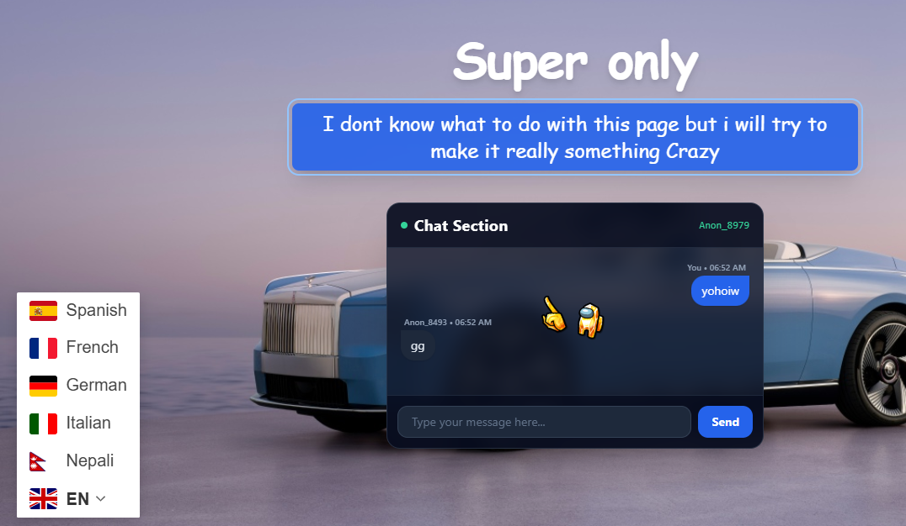
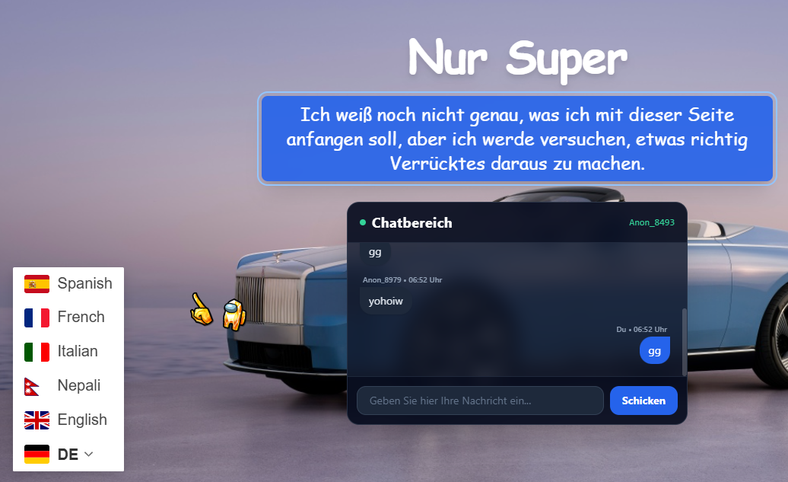

# NIRDESH@WEB-COLLECTION

A simple collection of useful web tools including wallpapers, chat, to-do, world time, and music.

**Live Demo:** https://nonopepep7-maker.github.io/Web-collection/

---

## About

NIRDESH@WEB-COLLECTION is a small web project built to learn, experiment, and create useful browser-based tools.

The project was created as a submission for **Hack Club Macondo** and developed on a low-spec **4GB RAM laptop**.

---

## Features

### Wallpaper Downloader

Browse and download wallpapers.

### Messup — Chat Simulator

A dual-dashboard chat system for exchanging messages between two chat panels.

### To-Do List

Add and remove tasks.

### Contact Form

Send messages through the contact form.

### Top Web

A collection of useful websites.

*Currently in development.*

### World Time

View time around the world.

*Currently in development.*

### Audio Player

Built-in background music player.

---

## What I Built

The project includes:

* CSS animations and keyframes
* Language switching using an API
* Dual chat interface
* Anonymous server connection
* Random usernames
* No account required
* No login required
* Multiple tools in one website

---

## Run Locally

No package installation or build process is required.

### 1. Clone the repository

```bash
git clone https://github.com/nonopepep7-maker/Web-collection.git
```

### 2. Open the project

```bash
cd Web-collection
```

### 3. Start the website

You can open `index.html` directly in your browser.

For development, using a local server is recommended.

### Using VS Code

Install the **Live Server** extension in VS Code.

Then:

1. Open the `Web-collection` folder.
2. Open `index.html`.
3. Right-click the file.
4. Select **Open with Live Server**.

The website will then open in your browser.

---

## Project Structure

```text
Web-collection/
│
├── index.html
├── README.md
├── LICENSE
│
├── pages/
│   ├── Form.html
│   ├── Social.html
│   ├── Topweb.html
│   ├── about.html
│   ├── hint.html
│   ├── moreinfo.html
│   ├── superonly.html
│   ├── time.html
│   ├── todolist.html
│   ├── wallapaper.html
│   └── web1.html
│
├── chat/
│   ├── dash1.html
│   ├── dash1.js
│   ├── dash2.html
│   └── dash2.js
│
├── scripts/
│   └── superonly.js
│
├── styles/
│   └── web1.css
│
└── assets/
    ├── images/
    └── audio/
```

---

## Preview

<p align="center">
  
</p>

<p align="center">
  
</p>

---

## About Me

**Nirdesh Acharya**
Builder from Nepal.

I enjoy building projects, experimenting with web technologies, and learning by creating things from scratch.

---

## Motivation

This project was built as a submission for **Hack Club Macondo**.

It was developed on a **4GB RAM laptop**, with a focus on keeping the project lightweight and simple.

---

## GitHub Stats


<p align="center">
  
</p>

---

## Tech Used

* HTML5
* CSS3
* JavaScript
* APIs
* GitHub Pages

---

## Credits

This project was inspired and motivated by **Hack Club Macondo**.

---

## License

This project is licensed under the **MIT License**.

See the [LICENSE](LICENSE) file for more information.

---

<p align="center">
  <strong>I believe consistency is the best practice.</strong>
</p>
